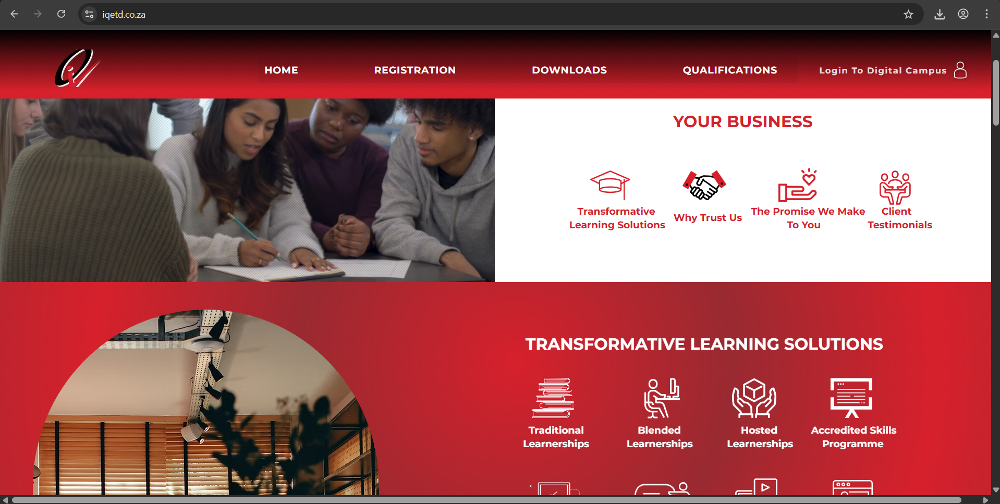
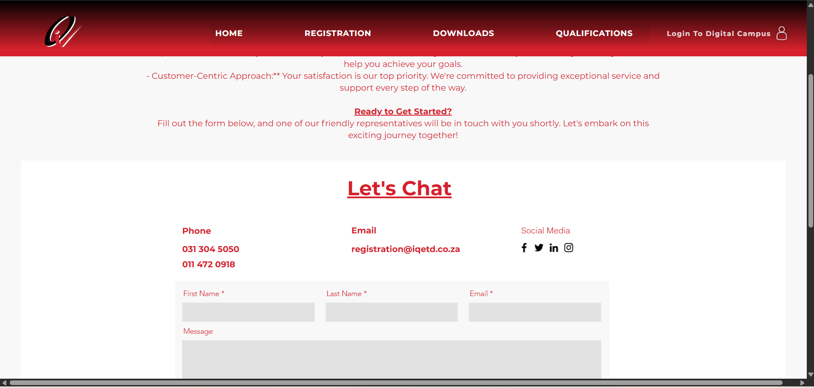

# IQETD Website

This is a professional website I designed and built using [Wix](https://www.wix.com) for **IQETD** – the Institute for Quality Education and Training Development.

🌐 **Live Website**: [https://www.iqetd.co.za](https://www.iqetd.co.za)

---

## 📄 Project Overview

The IQETD website is a multi-page platform created to showcase the institute's educational services, training programs, and contact information. The site was built using Wix to ensure rapid deployment, mobile responsiveness, and ease of content management.

---

## 🛠️ Tools & Features

- **Wix Website Builder**
- Custom theme and branding
- Responsive design (mobile/tablet friendly)
- Image galleries and structured content layout
- SEO basics configured (titles, descriptions, keywords)
- Contact form integration

---

## 📸 Screenshots

  
  

---

## ✍️ Created By

Designed and built by [x-GhxstFace23-x](https://github.com/x-GhxstFace23-x)

---

## 📌 Notes

This project was developed using Wix, so no source code is available. It is shared here as a visual and strategic design portfolio item.
